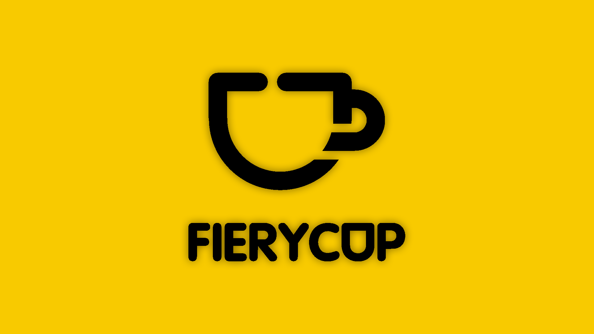

  

  
  

  <a href="https://discordapp.com/users/560859915380326422/"><a/>

### [🏆 GitHub Profile Trophy](https://github.com/fierycup/github-profile-trophy)
  

<!--
**FieryCup/FieryCup** is a ✨ _special_ ✨ repository because its `README.md` (this file) appears on your GitHub profile.

Here are some ideas to get you started:

- 🔭 I’m currently working on ...
- 🌱 I’m currently learning ...
- 👯 I’m looking to collaborate on ...
- 🤔 I’m looking for help with ...
- 💬 Ask me about ...
- 📫 How to reach me: ...
- 😄 Pronouns: ...
- ⚡ Fun fact: ...
-->
